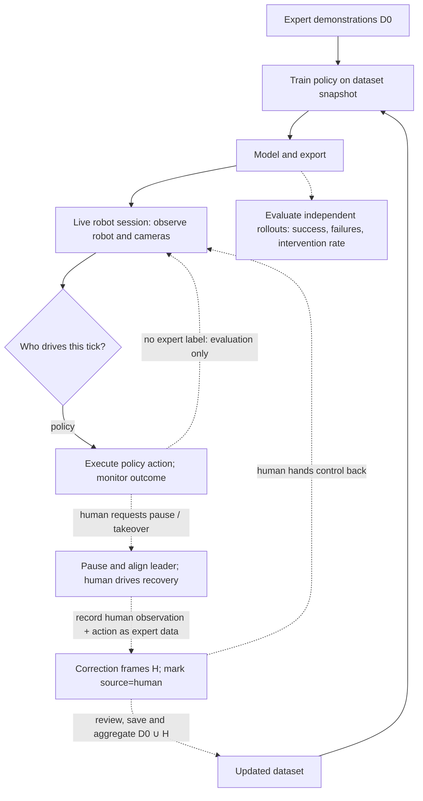

# DAgger and human-in-the-loop collection in Studio

## Short answer

Studio does **not** implement a DAgger workflow. It already has the parts for a manual intervention loop: a live robot session can run a policy or follow a leader, record the actions actually sent, append episodes to a LeRobot dataset, and train a new model from a dataset snapshot. But the recording and inference screens are separate, there is no supported joint policy-plus-dataset collection flow, and a recorded policy action is **not** an expert label. The [runtime architecture note](./runtime-session-architecture.md#modes-rather-than-session-types) explicitly calls human-in-the-loop (HIL) an unimplemented extension. [Session modes](../../backend/src/runtime/contract.py), [action selection](../../backend/src/runtime/action_source.py), [recording](../../backend/src/runtime/callbacks/recording.py), [recording screen](../../ui/src/routes/datasets/record/recording-viewer.tsx), [inference screen](../../ui/src/features/models/inference/inference-viewer.tsx).

## What DAgger means

Behavior cloning trains on states visited in expert demonstrations. After the learner makes a mistake, it may reach a state absent from that training set and make more mistakes. DAgger (Dataset Aggregation) changes *where labels come from*: train an initial policy on expert demonstrations, run that policy to visit new states, query the expert for the right action at those states, add `(state, expert action)` to the existing dataset, and train again. Repeat. The original algorithm can mix expert and learner **control** during rollout using a probability `β`, but still needs expert **labels** for the visited states. A label need not be the action the robot executed. [Ross, Gordon and Bagnell (2011), §3, Algorithm 3.1](https://proceedings.mlr.press/v15/ross11a/ross11a.pdf).

Human intervention is a practical variant, not identical to that algorithm. In human-gated DAgger (HG-DAgger), the human watches the learner, takes control when needed, demonstrates a recovery, then hands control back. Only the human-controlled portion supplies expert actions; the autonomous portion does not magically become labeled. The original DAgger guarantee therefore does not automatically apply to takeover-only data. An operator also cannot guarantee safety if they cannot recognize and stop a dangerous action in time. [Kelly et al., *HG-DAgger*, §II and Algorithm 1](https://arxiv.org/pdf/1810.02890).

## Human-in-the-loop pipeline

This diagram is a **target workflow**, not a screen currently available in Studio. Solid edges show paths already supported by separate components; dashed edges are the missing HIL wiring. `D0` is the original expert dataset and `H` contains new human corrections.

With **original** DAgger, add an expert query for learner-visited states on the autonomous branch and store the *expert's proposed action*, whether or not the expert drove the robot. With **takeover-only** collection, record only human correction windows for training; autonomous actions can still be logged for diagnosis or tagged separately, but should not be treated as expert targets. A pause or hold tick should not become a demonstration either. [Ross et al., Algorithm 3.1](https://proceedings.mlr.press/v15/ross11a/ross11a.pdf); [Kelly et al., Algorithm 1](https://arxiv.org/pdf/1810.02890); [Studio recording callback](../../backend/src/runtime/callbacks/recording.py).

## What Studio has, and what is missing

| Piece | Current behavior | Gap for HIL |
| --- | --- | --- |
| Control | `StudioActionSource` keeps leader and policy delegates alive; `FollowerSource` selects `hold`, `teleop`, or `policy`. A command can switch modes. | No intervention state or guided handover. Entering `policy` resets and warms the policy; teleop takeover does not first align an actuated leader to the follower. A safe pause/takeover/resume interaction needs explicit design. [Source](../../backend/src/runtime/action_source.py); [contract](../../backend/src/runtime/contract.py). |
| Collection | `RecordingCallback.on_tick` stores camera/state observation plus `event.action_sent` while recording in `teleop` **or** `policy`; it skips `hold`. Saved episodes go to a LeRobot dataset. | No expert query, action-source field, intervention boundary, or choice to record only expert frames. If you simply record a policy rollout, you will train on the policy's own actions. [Callback](../../backend/src/runtime/callbacks/recording.py); [feature schema](../../backend/src/runtime/dataset_features.py); [frame encoding](../../backend/src/internal_datasets/lerobot/lerobot_dataset.py). |
| UI | Dataset recording loads a dataset and requests teleop; inference loads a model and offers Play/Stop and a Teleoperate switch. | Neither screen offers model-plus-dataset collection, correction-only recording, or intervention review in one flow. The inference switch can select teleop, but does not start recording. [Provider](../../ui/src/features/robots/runtime-session-provider.tsx); [recording](../../ui/src/routes/datasets/record/recording-viewer.tsx); [inference](../../ui/src/features/models/inference/inference-page.tsx). |
| Retraining | A training job copies the chosen dataset to a snapshot and trains a policy. Local jobs can resume weights from a base model; the remote training target rejects a base-model resume. Checkpoints use `val/loss`. | No DAgger iteration coordinator, intervention-aware sampling, or automated comparison across rounds. Manual retraining on a dataset with added **expert** episodes is possible. [Worker](../../backend/src/workers/training_worker.py); [snapshot](../../backend/src/services/snapshot_service.py); [local resume](../../backend/src/services/training_backends/local.py); [remote limit](../../backend/src/services/training_targets/remote.py); [checkpoint selection](../../backend/src/training/job.py). |
| Evaluation | Library gym benchmarks report success rate and average reward; the inference UI lets a person watch a run. | No HIL-specific task-success, takeover-count, or recovery metric in the live session. [Benchmark results](../../../library/src/physicalai/benchmark/gyms/results.py); [runtime events](../../backend/src/runtime/contract.py). |

The backend primitives make a manually scripted switch within one episode plausible, but that is **not** a complete or safe DAgger feature. In particular, the existing recording path writes whatever was sent to the robot, not an independent expert answer to a learner state. [Action selection](../../backend/src/runtime/action_source.py); [recording callback](../../backend/src/runtime/callbacks/recording.py).

## How the costs and losses work

| Quantity | Meaning | Here |
| --- | --- | --- |
| Imitation loss `L(π)` | Difference between the policy's predicted action and an **expert** action on a labeled observation. For example, squared error for scalar actions `0.4` and `0.5` is `(0.4 - 0.5)² = 0.01`. DAgger changes the distribution of observations in this supervised training set; it does not require a new special DAgger loss. | Model-specific: ACT trains with masked action L1 plus optional VAE KL, and Pi0.5 trains with a flow-matching objective while using action-prediction MSE for validation. The trainer selects the best checkpoint by `val/loss`. [ACT](../../../library/src/physicalai/policies/act/model.py); [Pi0.5](../../../library/src/physicalai/policies/pi05/policy.py); [training job](../../backend/src/training/job.py). |
| Task cost `J(π)` | Expected sum of costs incurred by executing the policy over an episode, e.g. a penalty for failure or collision (or negative reward). It depends on states reached after previous actions. A small action loss on recorded examples does not prove a good success rate. | Studio's gym benchmarks track success and reward separately from training loss. There is no live HIL task-cost function. [Ross et al., §2](https://proceedings.mlr.press/v15/ross11a/ross11a.pdf); [benchmark](../../../library/src/physicalai/benchmark/gyms/results.py). |
| Expert cost-to-go `Q*` | Hypothetical future task cost after trying one action and then following the expert. It appears in the original paper's performance analysis, not as a numeric label a human must supply for every Studio frame. | Not implemented or needed for a first manual correction loop. [Ross et al., §2.2, Theorem 2.2](https://proceedings.mlr.press/v15/ross11a/ross11a.pdf). |

Think of imitation loss as "did the model copy the labeled action?" and task cost as "did the robot finish safely?" A policy can predict common expert actions well and still fail after one unfamiliar state. Original DAgger trains on expert-labeled *learner-visited* states to narrow that gap; takeover-only HIL instead gathers demonstrations at states where a human intervenes. A hand-set collision penalty or an automated intervention threshold is optional evaluation/control logic, not a prerequisite for supervised DAgger. [Ross et al., §§2 and 3](https://proceedings.mlr.press/v15/ross11a/ross11a.pdf); [Kelly et al., §II](https://arxiv.org/pdf/1810.02890).

## Comparison with LeRobot 0.6.0

Studio pins `lerobot[dataset]==0.6.0` in the [library](../../../library/pyproject.toml) and `lerobot[dataset,feetech]==0.6.0` in the [backend](../../backend/pyproject.toml). **LeRobot itself already has** a `lerobot-rollout --strategy.type=dagger` strategy at that tag. Its state machine is `AUTONOMOUS -> PAUSED -> CORRECTING -> PAUSED -> AUTONOMOUS`, with keyboard or pedal input and handover logic. By default it records *only correction windows*, one per episode; `record_autonomous=true` records both phases and tags frames `intervention=True/False`. It supports uploading the collected dataset. [LeRobot v0.6.0 strategy](https://github.com/huggingface/lerobot/blob/v0.6.0/src/lerobot/rollout/strategies/dagger.py); [configuration](https://github.com/huggingface/lerobot/blob/v0.6.0/src/lerobot/rollout/configs.py); [HIL guide](https://huggingface.co/docs/lerobot/hil).

LeRobot calls this strategy DAgger, but its default is closer to human-gated correction collection than to Algorithm 3.1: it does not query the expert at *every* autonomous learner state. In continuous mode the `intervention=False` frames store the executed **policy** action, so those frames still are not original-DAgger expert labels. Studio uses LeRobot's dataset and processor utilities, **not** LeRobot's rollout strategy: its control loop belongs to `physicalai.runtime.RobotRuntime` and `StudioActionSource`. Copying the CLI strategy into Studio would bypass the session that already owns the robot. Reuse its intervention semantics and handover ideas, not a second hardware owner. [LeRobot v0.6.0 strategy](https://github.com/huggingface/lerobot/blob/v0.6.0/src/lerobot/rollout/strategies/dagger.py); [Studio action source](../../backend/src/runtime/action_source.py); [runtime architecture](./runtime-session-architecture.md#why-one-session).

A small first step would be a **human-gated** flow: load both model and dataset into one session, provide pause/takeover/resume controls with a safe leader handover, record only human-driven corrections (or tag and filter them), append reviewed corrections to the original dataset, retrain locally, then compare independent rollouts. Calling this *original DAgger* would additionally require expert action labels at learner-visited states. No custom cost function is needed to start; task-success and intervention counts are more informative than `val/loss` alone. [Studio session](../../backend/src/runtime/session.py); [LeRobot v0.6.0 strategy](https://github.com/huggingface/lerobot/blob/v0.6.0/src/lerobot/rollout/strategies/dagger.py); [Ross et al., Algorithm 3.1](https://proceedings.mlr.press/v15/ross11a/ross11a.pdf).
